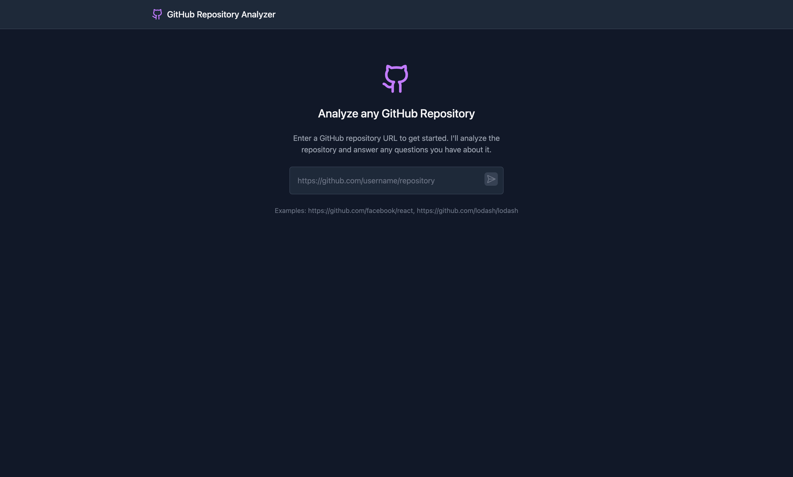
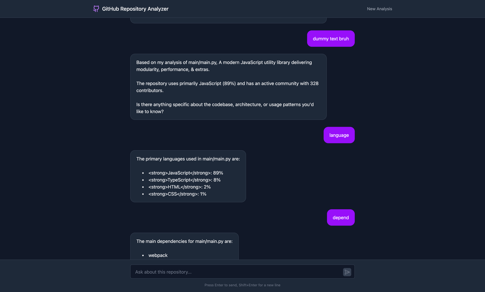

# GitHub Repo Analyzer

This is a **Vite + React** application for analyzing GitHub repositories. It provides insights into repository structures, contributions, and more. You can chat with it about the repo too.




## 🚀 Setup Instructions

### 1. Clone the Repository

```sh
git clone https://github.com/yourusername/github-repo-analyzer.git
cd github-repo-analyzer
```

### 2. Install Dependencies

```sh
npm install
```

### 3. Start the Development Server

```sh
npm run dev
```

This will start the app in development mode. The default URL is `http://localhost:5173/`.

### 4. Build for Production

```sh
docker compose up
```

This will pull the necessary images (if not already available) and start the API.

```sh
docker compose down
```

To stop the API.

## 📜 License

This project is licensed under the MIT License.

## 🤝 Contributing

Pull requests are welcome! Open an issue for bug reports or feature requests.

## ⭐ Acknowledgments

Built using **Vite**, **React**, and **GitHub API**.
